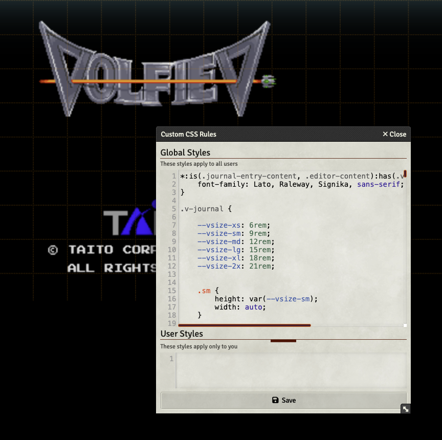

# Custom CSS Rules

Allows a user to setup custom CSS rules in a world

## What problem does this solve?

When adding a lot of modules, every now and then they don't quite agree with each other on where things should live. A small amount of CSS can fix this, but manually patching CSS in the server or writing a local module is a pain. This module allows you to quickly and easily enter per-world CSS rules to make these tweaks instead.

## Changelog

## v2.0.4

Complete overhaul of functionality. Rules are replaced by one large styelsheet editor.
### v1.1.0

Added the ability to organize Rules. This is *not* folder functionality!
